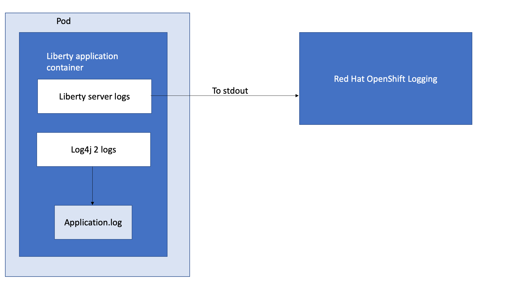
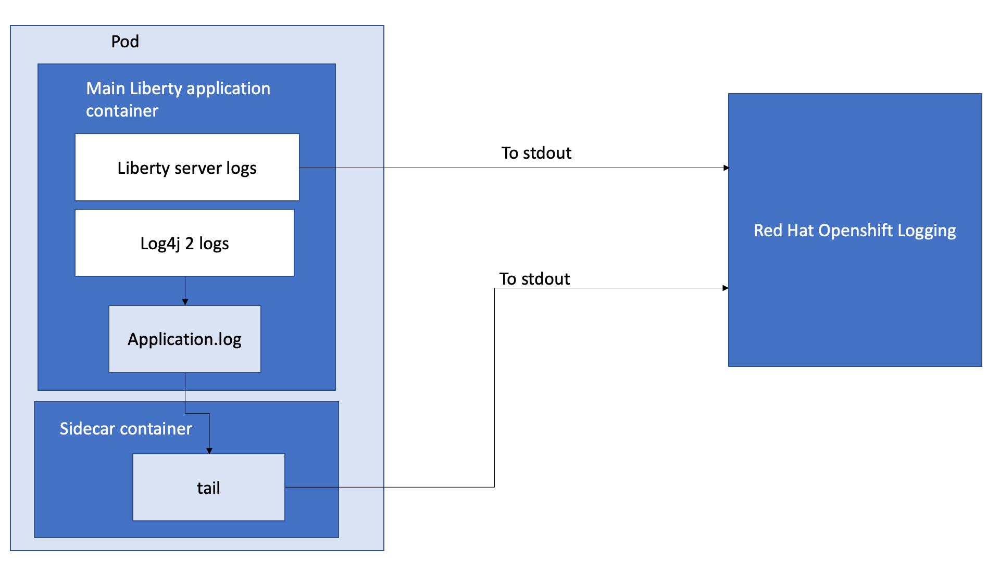
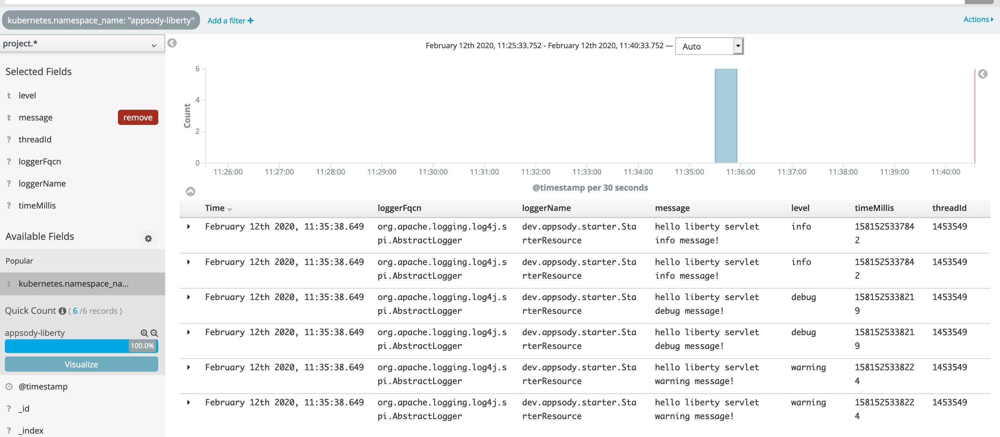
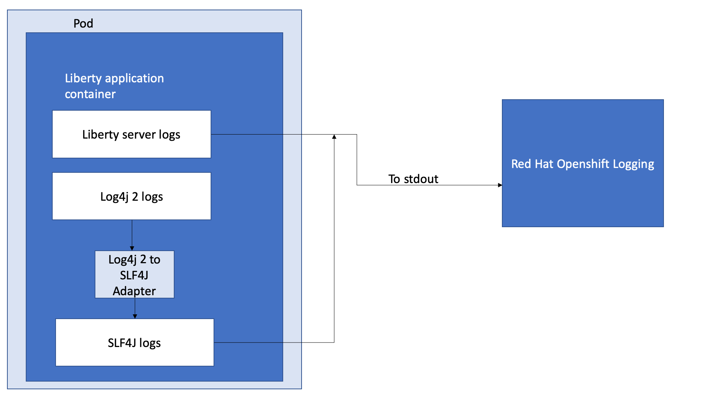

= How to send Log4j 2 logs to Red Hat OpenShift Container Platform EFK stack =
Yushan Lin <https://github.com/Yushan-Lin>

When developing applications, you can choose from many logging utility options, based on your needs. One of these logging utilities, Log4j 2, is commonly used for logging in applications.
Log4j 2 has an API that you can use to output log statements to various output targets. In Open Liberty logging, only JUL (`java.util.logging`) logs are merged with Liberty logs and sent to `messages.log/console`. When running your application in a Docker container in OpenShift, Log4j 2 logs that are written to the file system aren't automatically picked up. In this blog, we'll show you how to get your Log4j 2 logs into RHOCP’s EFK stack so you can view and analyze them. We'll present two approaches to forward logs using a sidecar container and a third approach to forward Log4j 2 logs to JUL.

When deploying your application on Open Liberty, you must specify where you want to send your Log4j 2 logs. Log4j 2 logs aren't merged with Liberty server logs. You might want to visualize both your Log4j 2 application logs and Liberty logs on the same Kibana dashboard to better monitor your applications and servers.



== Using sidecar containers

In Kubernetes environments, the best practice is to send your logs to stdout. The platform will be set up to consume content from the pod's stdout and direct it to the logging facilities of the cluster.
One of the options to send your Log4j 2 logs to RHOCP's EFK stack, is to use sidecar containers. Pods can have multiple containers that work together. While one container creates and writes to a log file, another "sidecar" container, in the same pod, can be configured to read those files from the first container [1].  In this case, the sidecar container can:

* Stream application logs to its own stdout.

* Run a logging agent, which is configured to pick up logs from an application container.

For both options, you want to setup a shared volume for the directory of your application logs:

. For your deployed application, modify the deployment to define the shared volume:
+
----
volumes:
  - name: outputlog
    emptyDir: {}
----

. Mount the volume to your main application container:
+
----
volumeMounts:
  - name: outputlog
    mountPath: /output/logs
----

=== Stream application logs to its own stdout


By streaming the application logs to its own stdout, it separates the Liberty server logs from the application logs. In Kibana, the logs appears as if they came from the same pod, but from the sidecar container.

. Configure an Appender for Log4j 2 to send your logs to a File, or RollingFile:
+
```
<Appenders>
    <File name="File" fileName="${log-path}/app.log" append="true">
      <JsonLayout compact="true" eventEol="true"/>
    </File>
    <RollingFile name="DailyRolling" fileName="${log-path}/myexample.log" append="true"
    filePattern="${log-path}/myexample-%d{yyyy-MM-dd}-%i.log">
        <JsonLayout compact="true" eventEol="true"/>
      <Policies>
           <TimeBasedTriggeringPolicy interval="1" modulate="true"/>
      </Policies>
    </RollingFile>
</Appenders>
```

. Add the Appender as a reference to your Logger:
+
```
<Loggers>
     ...
     <Logger....>
     <AppenderRef ref="File"/>
     <AppenderRef ref="RollingFile"/>
     </Logger>
      ....
</Loggers>
```

. Modify your application deployment to add a sidecar container that tails your application logs. You want to write the log to a persistent volume for storage:

.. Create another container and mount the volume of the directory where the log is located. This command will tail the logs to send them to stdout:
+
```
  - name: app-sidecar
          image: 'linyusha/java-microprofile:latest'
          args:
            - /bin/sh
            - '-c'
            - tail -n+1 --retry -f /output/logs/app.log
          resources: {}
          volumeMounts:
            - name: outputlog
              mountPath: /output/logs
```


. On your OpenShift Kibana dashboard, you should see the application logs under the project.* index along with your other Liberty server logs:
+


=== Side container running as a logging agent

You can create a sidecar container with a separate logging agent configured specifically to forward your application's logs. This provides you the flexibility to use Fluentd to specify where you want to send your Log4j 2 logs to. In this case, we are directing our logs to stdout to send them to RHOCP EFK stack.

. Create a Fluentd config map specifying the `source` (where you want Fluentd to scrape your logs) and `match` (where you want to send the logs to):
+
```
apiVersion: v1
kind: ConfigMap
metadata:
  name: fluentd-config
data:
  fluentd.conf: |
    <source>
      @type tail
      <parse>
        @type json
      </parse>
      path /output/logs/app.log
      pos_file /path/to/position/file/app.log.pos
      tag project.*
    </source>

    <match **>
      @type stdout
    </match>
```

. Create a sidecar container running Fluentd. The pod mounts a volume where Fluentd can pick up its configuration data. To modify your deployment:

.. Add the config map as a volume to your deployment:
+
```
 volumes:
  - name: outputlog
    emptyDir: {}
  - name: config-volume
    configMap:
      name: fluentd-config
```

.. Create the sidecar with Fluentd logging agent:
+
```
  - name: count-agent
    image: k8s.gcr.io/fluentd-gcp:1.30
    env:
    - name: FLUENTD_ARGS
      value: -c /etc/fluentd-config/fluentd.conf
    volumeMounts:
    - name: outputlog
      mountPath: /output/log
    - name: config-volume
      mountPath: /etc/fluentd-config
```

The following are example outputs for both sidecar options.

Sample log in application:
```
        LOGGER.info("hello liberty servlet info message!");
        LOGGER.debug("hello liberty servlet debug message!");
        LOGGER.log(Level.WARN, "hello liberty servlet warning message!");
```

Sample log output directed to stdout:
```
{"timeMillis":1581629336498,"thread":"Default Executor-thread-20","level":"INFO","loggerName":"application.servlet.LibertyServlet","message":"hello liberty servlet info message!","endOfBatch":false,"loggerFqcn":"org.apache.logging.log4j.spi.AbstractLogger","threadId":65,"threadPriority":5}
{"timeMillis":1581629336646,"thread":"Default Executor-thread-20","level":"DEBUG","loggerName":"application.servlet.LibertyServlet","message":"hello liberty servlet debug message!","endOfBatch":false,"loggerFqcn":"org.apache.logging.log4j.spi.AbstractLogger","threadId":65,"threadPriority":5}
{"timeMillis":1581629336646,"thread":"Default Executor-thread-20","level":"WARN","loggerName":"application.servlet.LibertyServlet","message":"hello liberty servlet warning message!","endOfBatch":false,"loggerFqcn":"org.apache.logging.log4j.spi.AbstractLogger","threadId":65,"threadPriority":5}
```

Most of the above information was referenced from: https://kubernetes.io/docs/concepts/cluster-administration/logging/

For more information about Log4j 2 appenders you can check out: https://logging.apache.org/log4j/2.x/manual/appenders.html

For more information about Application logging in EFK:
https://kabanero.io/guides/app-logging-ocp-4-2/

== Log4j 2 to SLF4J



Another way to direct your Log4j 2 logs to RHOCP's EFK stack is using the [Log4j 2 to SLF4J Adapter](https://logging.apache.org/log4j/2.x/log4j-to-slf4j/index.html). SLF4J can be configured to use JUL as the underlying implementation. The Log4j 2 to SLF4J Adapter allows applications coded to the Log4j 2 API to be routed to SLF4J. You can use this technique to merge your Log4j 2 logs with Liberty logs. Using this adapter may cause some loss of performance as the Log4j 2 messages are formatted before they can be passed to SLF4J [2].  After being passed to SLF4J, the log will be formatted and merged with Liberty logs before being passed to console.log/stdout.
To use this adapter, add the dependency to your `pom.xml`:
```
		<dependency>
		  <groupId>org.apache.logging.log4j</groupId>
		  <artifactId>log4j-to-slf4j</artifactId>
		  <version>2.13.0</version>
		</dependency>
		<dependency>
		    <groupId>org.slf4j</groupId>
		    <artifactId>slf4j-jdk14</artifactId>
		    <version>1.7.7</version>
		</dependency>
		<dependency>
		    <groupId>org.slf4j</groupId>
		    <artifactId>slf4j-api</artifactId>
		    <version>1.7.25</version>
		</dependency>
```

To enable JSON logging in Liberty, add the appropriate environment variables in `bootstrap.properties` under your server directory to enable JSON logging:
```
# generate console log in json and route the following sources
com.ibm.ws.logging.console.source=message, trace, ffdc, audit, accessLog
com.ibm.ws.logging.console.format=json
com.ibm.ws.logging.console.log.level=INFO
```

The following log is an example output:
```
{"type":"liberty_message","host":"192.168.0.104","ibm_userDir":"\/Users\/yushan.lin@ibm.com\/Documents\/archived-guide-log4j\/finish\/target\/liberty\/wlp\/usr\/","ibm_serverName":"log4j.sampleServer","message":"hello liberty servlet info message!","ibm_threadId":"00000035","ibm_datetime":"2020-02-13T11:27:07.789-0500","module":"application.servlet.LibertyServlet","loglevel":"INFO","ibm_methodName":"doGet","ibm_className":"application.servlet.LibertyServlet","ibm_sequence":"1581611227789_0000000000016","ext_thread":"Default Executor-thread-8"}
{"type":"liberty_trace","host":"192.168.0.104","ibm_userDir":"\/Users\/yushan.lin@ibm.com\/Documents\/archived-guide-log4j\/finish\/target\/liberty\/wlp\/usr\/","ibm_serverName":"log4j.sampleServer","message":"hello liberty servlet debug message!","ibm_threadId":"00000035","ibm_datetime":"2020-02-13T11:27:07.791-0500","module":"application.servlet.LibertyServlet","loglevel":"FINE","ibm_methodName":"doGet","ibm_className":"application.servlet.LibertyServlet","ibm_sequence":"1581611227791_0000000000001","ext_thread":"Default Executor-thread-8"}
{"type":"liberty_message","host":"192.168.0.104","ibm_userDir":"\/Users\/yushan.lin@ibm.com\/Documents\/archived-guide-log4j\/finish\/target\/liberty\/wlp\/usr\/","ibm_serverName":"log4j.sampleServer","message":"hello liberty servlet warning message!","ibm_threadId":"00000035","ibm_datetime":"2020-02-13T11:27:07.792-0500","module":"application.servlet.LibertyServlet","loglevel":"WARNING","ibm_methodName":"doGet","ibm_className":"application.servlet.LibertyServlet","ibm_sequence":"1581611227792_0000000000017","ext_thread":"Default Executor-thread-8"}
```

As shown in this post, there are different ways to send your Log4j 2 and other non-JUL logs to the OpenShift EFK stack.

**Related links**

* link:https://openliberty.io/docs/ref/general/#logging.html[Open Liberty logging documentation]

* link:https://developer.ibm.com/videos/use-json-logging-in-open-liberty[Use JSON logging in Open Liberty]

* link:https://openliberty.io/blog/2019/12/03/custom-fields-json-logs.html[Adding custom fields to JSON logs in Open Liberty]

* https://community.ibm.com/community/user/imwuc/viewdocument/on-demand-using-liberty-with-elast[Using Liberty with Elastic Stack (aka ELK)]

**References**

[1] https://kubernetes.io/docs/concepts/workloads/pods/pod-overview/

[2] https://logging.apache.org/log4j/2.x/log4j-to-slf4j/index.html

[3] https://kubernetes.io/docs/concepts/cluster-administration/logging/
