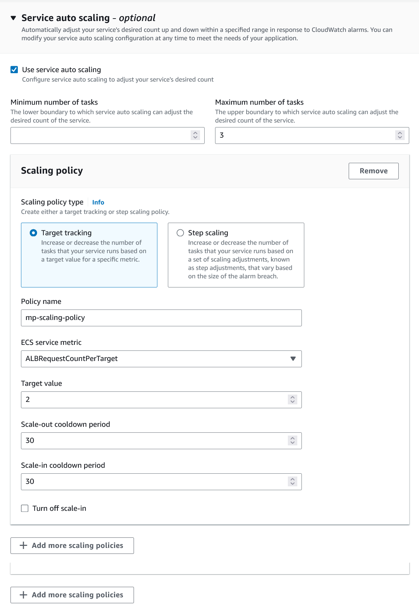

= Running Open Liberty on Amazon Elastic Container Service with AWS Fargate
Alex Butcher <https://github.com/abutch3r>
:imagesdir: /
:url-prefix:
:url-about: /

Serverless applications continue to be a hot topic in 2024. With MicroProfile being widely adopted by cloud native applications, many developers want to know:

_How to run MicroProfile applications in Amazon Elastic Container Service in a Serverless manner?_

This post demonstrates how to run a MicroProfile application on Open Liberty in Amazon Elastic Container Service with AWS Fargate.

== Function vs Container as a Service?
AWS with AWS Lambda became the leaders in offering _Function as a Service_ (FaaS) as what is largely considered the first available Serverless Offering. FaaS offerings typically take a very small amount of code and allow it to be deployed in per usage model that is not available when deploying applications on top of other compute offerings like Amazon Elastic Kubernetes Service.

In recent years _Container as a Service_ (CaaS) offerings such as Amazon Elastic Container Service(ECS) with AWS Fargate have become available that offering the ability to deploy containers without having to deploy and manage the related compute infrastructure.

CaaS offerings provide a better fit for Cloud native Web Applications and to Lift and Shift compared to FaaS offerings. This is due to the fact most CaaS offerings use standard transport protocols such as HTTP, while FaaS often requires the use of a platform specific SDK to handle any request.

This post uses Open Liberty and MicroProfile to run a serverless application in Amazon ECS with AWS Fargate.

=== Amazon Elastic Container Service with AWS Fargate

Amazon Elastic Container Service (Amazon ECS) with AWS Fargate is a fully managed container orchestration service that helps you easily deploy, manage, and scale containerized applications in a serverless manner.

More inforamtion about Amazon ECS can be found https://aws.amazon.com/fargate/[here]

== Deploying an Open Liberty Container to Amazon ECS

To run a MicroProfile application

=== Pre-requisites
Before you start, at a minimum you will need the following prerequisites:

* An https://aws.amazon.com/[AWS] Administrator account*
* An Amazon ECS Cluster with AWS Fargate

If you are planning on building and containerizing the MicroProfile application and publishing the image for use with Amazon ECS, these are the additional prerequisites required:

* https://www.docker.com/[Docker]
* https://git-scm.com/book/en/v2/Getting-Started-The-Command-Line[Git CLI]
* https://maven.apache.org/[Maven]
* An externally accessible container registry that can host your images such as Amazon Elastic Container Registry(Amazon ECR) or Dockerhub.

=== Getting Started
If you don't have experience with Open Liberty and MicroProfile or wish to understand more about the application used in this blog follow the steps in <<Create your MicroProfile application>> and <<Uploading the container to a registry>>.

If you already have experience with Open Liberty and MicroProfile it is recommended you go straight to <<Creating your Amazon ECS Cluster>> as for this blog, there is a publicly accessible image hosted on IBM Cloud Container Registry (ICCR) that can be used.

=== Create your MicroProfile application
In this post, we use https://openliberty.io/guides/getting-started.html[Open Liberty Getting Started guide] to get a sample MicroProfile application that exposes a number of HTTP accessible resources that can be easily used in a CaaS Serverless environment.

Follow the guide up to and including https://openliberty.io/guides/getting-started.html#running-the-application-in-a-docker-container[Running the application in a Docker container]

If you want to skip the steps within the Getting Started guide, you can use the https://github.com/OpenLiberty/guide-getting-started/tree/prod/finish[finish] directory of the Github repository to build the finished application.

=== Uploading the container to a registry
To use the image created in <<Create your MicroProfile application>> then it needs to be uploaded to a internet accessible container registry.

Amazon ECS supports a range of container registries outlined in their https://docs.aws.amazon.com/AmazonECS/latest/developerguide/task_definition_parameters.html#container_definition_image[Image Registry requirements]. As this blog requires an AWS account, you are most likely to have access to Amazon ECR to act as your registry. To upload the image use the https://docs.aws.amazon.com/AmazonECR/latest/userguide/getting-started-console.html[Get Started] instructions for Amazon ECR.

=== Creating your Amazon ECS Cluster
To create your Amazon ECS cluster follow step 1. in https://docs.aws.amazon.com/AmazonECS/latest/developerguide/getting-started-fargate.html[Getting started with the console using Linux containers on AWS Fargate].

=== Creating your Task Definition
Amazon ECS runs either Services or Jobs that use https://docs.aws.amazon.com/AmazonECS/latest/developerguide/task_definitions.html[Task Definitions] to define the runtime configuration for the task. The task definition includes some of the following properties:

* Container Image URL
* CPU & Memory
* Port Mappings
* Environment variables
* Compatibilities

The values of these properties cannot be overridden by the service or job definition that execute the task definition. For example, if the same task definition was used in Development and Production deployments, then they would use the same amount of CPU. As such it is recommended that separate task definitions are defined for each environment.

The instructions below will use a publicly accessible Open Liberty getting started guide container image. If you are using your own container, substitute `icr.io/appcafe/open-liberty/samples/getting-started` with the path for your image.

It is possible to create the Task Definition using the UI or by uploading JSON, for this blog we will upload JSON.

==== Creating Task definition using JSON
To apply the below example task definition to create a new Task definition follow Step 2. in https://docs.aws.amazon.com/AmazonECS/latest/developerguide/getting-started-fargate.html[Getting started with the console using Linux containers on AWS Fargate].

Before applying, ensure that the `logConfiguration.options.awslogs-region` setting matches the region you are planning on deploying into.

Example Open Liberty Amazon ECS Task Definition:

[source]
----
{
    "family": "ol-getting-started-blog",
    "containerDefinitions": [
        {
            "name": "open-liberty-getting-started",
            "image": "icr.io/appcafe/open-liberty/samples/getting-started",
            "cpu": 512,
            "memory": 1024,
            "portMappings": [
                {
                    "name": "liberty-getting-started-80-tcp",
                    "containerPort": 80,
                    "hostPort": 80,
                    "protocol": "tcp",
                    "appProtocol": "http"
                },
                {
                    "name": "liberty-getting-started-443-tcp",
                    "containerPort": 443,
                    "hostPort": 443,
                    "protocol": "tcp",
                    "appProtocol": "http"
                }
            ],
            "essential": true,
            "environment": [
                {
                    "name": "default.http.port",
                    "value": "80"
                },
                {
                    "name": "default.https.port",
                    "value": "443"
                }
            ],
            "environmentFiles": [],
            "mountPoints": [],
            "volumesFrom": [],
            "logConfiguration": {
                "logDriver": "awslogs",
                "options": {
                    "awslogs-create-group": "true",
                    "awslogs-group": "/ecs/ol-getting-started-demo",
                    "awslogs-region": "us-east-1",
                    "awslogs-stream-prefix": "ecs"
                }
            }
        }
    ],
    "executionRoleArn": "",
    "networkMode": "awsvpc",
    "requiresCompatibilities": [
        "FARGATE"
    ],
    "cpu": "512",
    "memory": "1024",
    "runtimePlatform": {
        "cpuArchitecture": "X86_64",
        "operatingSystemFamily": "LINUX"
    }
}
----

By default, Open Liberty exposes ports 9080 and 9443 for HTTP and HTTPS traffic respectively. The server.xml used by the server contains two variables: `default.http.port` and `default.https.port` that allow the default port values to be overridden. By setting environment variables to 80 and 443 respectively we can then expose the service externally on these ports.

A full list of task definition parameters can be found https://docs.aws.amazon.com/AmazonECS/latest/developerguide/task_definition_parameters.html[here].

As you now have our Task definition, we need to create a service that uses the definition.

=== Creating the Service
For the purposes of this blog we will create an instance that uses HTTP.

The Amazon ECS supports two types of runtime definitions, Service and Tasks. Tasks define batch type workloads and typically don't have any external input while running, while Services are suited to web applications. As such Services are used for this blog.

.To Create the Service
. Go to the Amazon ECS Service
. Go to `Clusters`
. Select the Cluster you created earlier
. Under the Services Tab, click `Create`
. Under `Environment`
.. Update Compute Options from `Capacity provider strategy` to `Launch Type`
.. Ensure Launch type is `Fargate`
. Under `Deployment Configuration`
.. For Family, set to the Task Definition created earlier
.. Provide the service a name e.g. ol-getting-started-service-1
.. Set the desired count to `0`*
. Under `Networking`
.. Leave VPC and subnets as is
.. Select `Create a new security group`
... Add rules set out in <<_security_group_rules, Security Group rules>>
. Under `Load Balancing`
.. Set `Load balancer type` to `Application Load Balancer`
.. Select `Create a new load balancer`
.. Provide a name
.. Ensure the mapping is to the HTTP port for the Task Definition
.. Select Create a new listener
... Select the Listener for Port 80
.. Select `Create a new target group`
.. Update the `Health check path` to use `/health`**
. Click `Create`

&#42; When first created it is possible
&#42;&#42; the `/health` endpoint is provided by the MicroProfile Health feature and is ideal for reporting health in containerized deployments

[#_security_group_rules]
==== Security Group rules
The default security group rules are deliberately restrictive to prevent unintended exposure. As such rules need to be defined that allow for the communication on a set of ports.

The following rules allow for HTTP and HTTPS traffic on both Open Liberty and HTTP/S default ports.

.ECS Security Group Rules
|===
|Type |Protocol |Port Range |Source |Values

|HTTP
|TCP
|80
|Anywhere
|0.0.0.0/0, ::/0

|Custom TCP
|TCP
|9080
|Anywhere
|0.0.0.0/0, ::/0

|HTTPS
|TCP
|443
|Anywhere
|0.0.0.0/0, ::/0

|Custom TCP
|TCP
|9443
|Anywhere
|0.0.0.0/0, ::/0
|===

The above rules will generate a security policy that looks like this
image::/img/blog/amazon-ec2-security-group-port-mapping.png

=== Starting the Service.
Now that the Service has been created with its required assets and the security group has been updated so that we will be able to communicate with it, we can start it.

- Update the service
- Change the value of `Desired tasks` to `1`
- Click `Save`

This will start an instance of our container in ECS.

Once it has reported as running and healthy we can look at accessing it.

=== Accessing the Service
With the service now running we can start to make requests against it.

The first step is to get the DNS name for the Load Balancer. We can get the DNS name for the load balancer either from the load balancer itself or from the target Service.

.Obtaining the DNS name from your Load Balancer
. Go to the EC2 Service
. Select `Load Balancers` under `Load Balancing`
` Copy the address from the `DNS name` column

.Obtaining the DNS name of your Load Balancer from the Service
. Go to your cluster
. Select your Service
. Go to the Networking tab
. Either copy or click `open address`

If you have exposed the service on the non-protocol port, you will need to add the port to the URL.

image::/img/blog/amazon_ecs_host_page.png

=== Monitoring our service

With the Service started, we can start to monitor it using the Amazon ECS tooling and Amazon CloudWatch.

==== CPU and Memory usage

Within the service definition we can see a level of CPU and memory usage

image::/img/blog/amazon_ecs_service_health.png[Amazon ECS Service health ,width=90%,align="center"]

==== Logs

Amazon ECS captures the `STDOUT` and `STDERR` output from the instances and provides them in the `Logs` tab within the Service. If logs are written to file, then you would need to exec in to the running container to retrieve them.

If you have multiple instances of the container running then all the messages will appear in the table together, though will state which instance they came from. You can review logs of individual instances by clicking on the links.

=== Scaling your application via auto-scaling policies
Manually scaling is ok for testing, but in production we want the environment to use performance indicators to make scaling decisions for us.

Scaling policies can be applied and adjusted after the Service has been created. The policy that you use should best reflect the expected bottlenecks of your application. If your application handles complex workloads the CPU or Memory. It is possible to define more than one scaling policy per service

The policy allows you to define:

* Number of tasks (instances of your application)
    * Minimum number (>=0 &amp; \<= desired tasks)
    * Maximum number (>=0)
* Scaling metric
** Percentage of CPU
** Percentage of Memory
** Number of ALB(Application Load Balancer) Requests over a period of time
* Threshold relative to the metric
* Scale in and out periods

The metrics use Amazon CloudWatch data and associated "alarms" to trigger automated scale actions and reviews them based on the periods it is set to.

For Open Liberty, all 3 scaling metrics can be used. The decision as to which as metric to use relates to the nature of the application that has been deployed on to Open Liberty. If you have requests that are CPU heavy, then CPU based alarms would be the recommendation, however if you have high volume, but low CPU requests then ALB requests* might be a better fit.

ECS Scaling policies are split into 2 alarms:

* Scaling out
* Scaling in

The first alarm is the primary one that we set and AWS will provide a metric definition for scaling in that is matched to the scaling out definition, Though both can be adjusted independently of the Service definition.

The alarms gather Amazon CloudWatch data based on their metric over time, this is to try and prevent accidental scaling events of both out and in. If an instance were to experience a short high load period, then when compared to corresponding data points, where we are at typical workload then the alarm is not triggered and we don't spin up unneeded instances. For scaling in, this is the reverse in that we don't ideally want to terminate instances that might be handling workload

For this blog as the application is not CPU or memory intensive, we will use the amount of requests hitting the ALB we receive to trigger scaling events.

To create an ALB request Scaling policy, you can edit the instances scaling policy:

. Go to your cluster
. Select your Service
. Select `Update service`
. Set the `Desired tasks` to `1`
. Expand `Service auto scaling`
. Set the minimum to `1`
. Set the maximum to `2`
. Click `+ Add scaling policy`
. Give your policy a name e.g. `mp-sp`
. Set the `ECS service metric` to `ALBRequestCountPerTarget`
. Set the Target value to `2`
. Set `Scale out cooldown period` to `30`
. Set `Scale in cooldown period` to `30`
. Click Update

The target value is set to a very low value so that it is easier to cause a scaling out alarm to trigger and create new instances. This value should be scoped to the requirements of the application and also that the amount of other resources provided are capable of handling that type of workload.

Having created our policy we can now try to cause the alarm to trigger and cause our service to increase the number of instances available.
As we are looking at requests against the ALB, we just need to invoke our applications URL to generate some traffic.

Given that it requires 3 datapoints above our target in a given period, you just need to invoke it 3 times in the period being measured. After the trigger has been activated you will see the number of instances scale out.

image::/img/blog/amazon_ecs_scaled_instances.png[Amazon ECS scaled out service,width=90%,align="center"]

You have now run and scaled your MicroProfile Application on Amazon ECS with AWS Fargate!

== Additional Resources
* https://aws.amazon.com/ecs/[Amazon Elastic Container Service]
* https://aws.amazon.com/fargate/[AWS Fargate]

* https://docs.aws.amazon.com/AmazonECS/latest/developerguide/task_definitions.html[Amazon ECS Task Definitions]
* https://docs.aws.amazon.com/AmazonECS/latest/bestpracticesguide/intro.html[Amazon ECS Best Practices]
* https://docs.aws.amazon.com/elasticloadbalancing/latest/application/introduction.html[Amazon Elastic Load Balancing]
* https://docs.aws.amazon.com/elasticloadbalancing/latest/application/create-https-listener.html#https-listener-certificates[Create an HTTPS listener for your Application Load Balancer]
* https://aws.permissions.cloud/[AWS Permissions]
* https://docs.aws.amazon.com/AmazonECS/latest/developerguide/service-autoscaling-targettracking.html?icmpid=docs_ecs_hp-deploy-failure-detection[Scale your Amazon ECS service using a target metric value].

